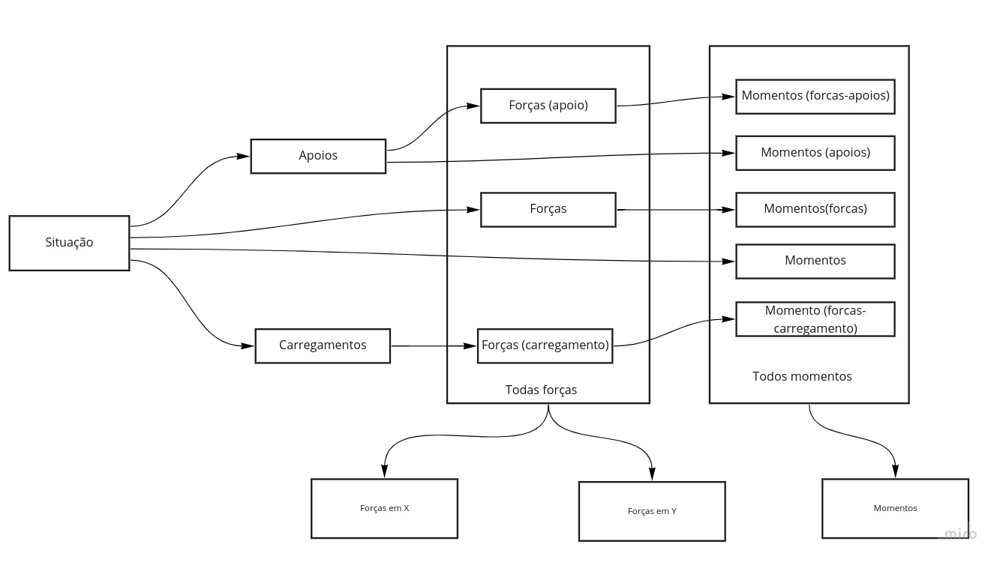
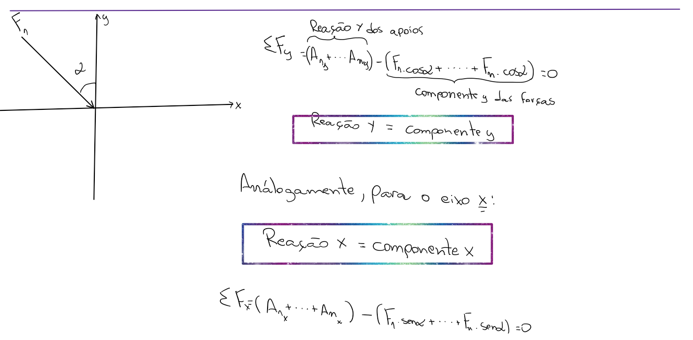
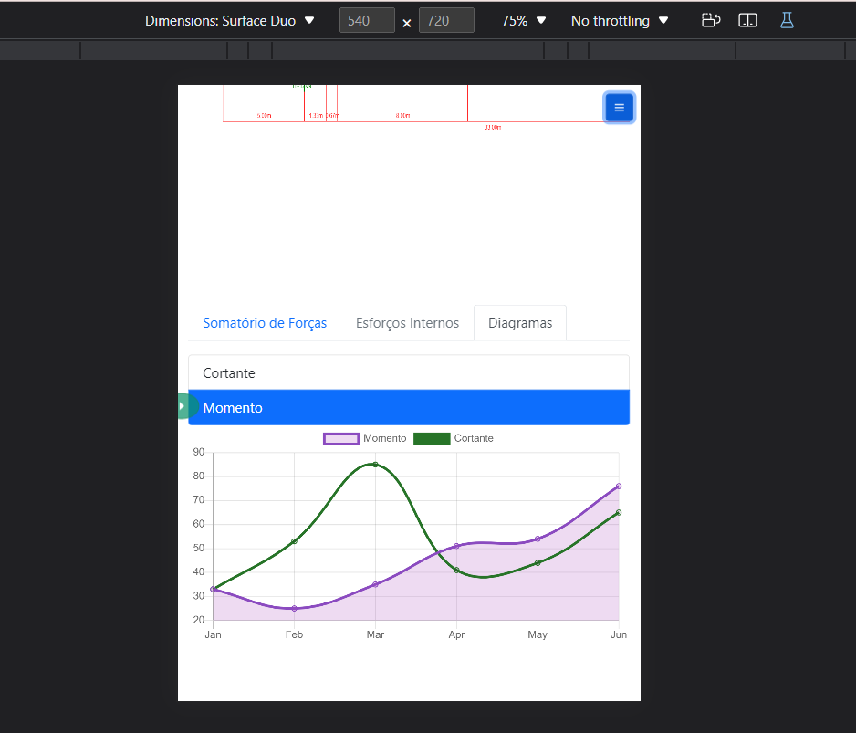
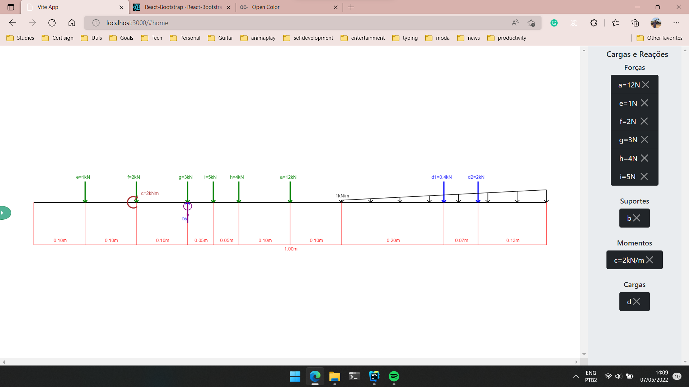

# Resistência dos materiais e elementos de máquinas - 2022.1

## Vigas Calculator

Vigas calculator é um software de simulação esforços físicos exercídos sobre uma viga. Tendo como objetivo
demonstrar as forçar de reações internas e nos apoios da viga.

### Introdução

### Desenvolvimento

Fluxo calculo de momentos e forças

> 08/05/2022 - Adicionado Cálculo de somatório de forças no eixos X e Y.
> Como demonstra os seguintes registros:
> 
> Resultado em tela:
> 

> 10/05/2022 - Sentido das compoenetes forças
> 

> 11/05/2022 - Adicionado responsividade e gráfico
> 

### Conclusão

### Referências

